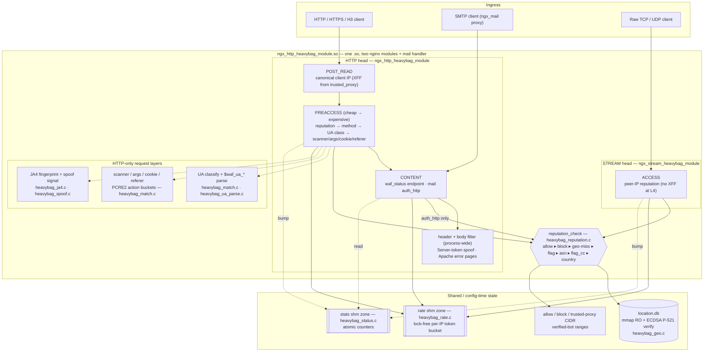
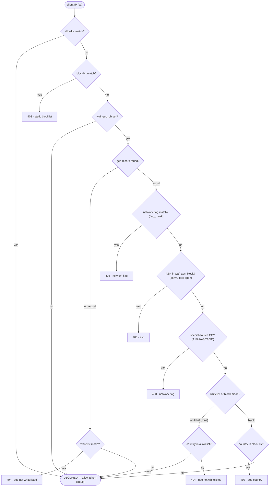
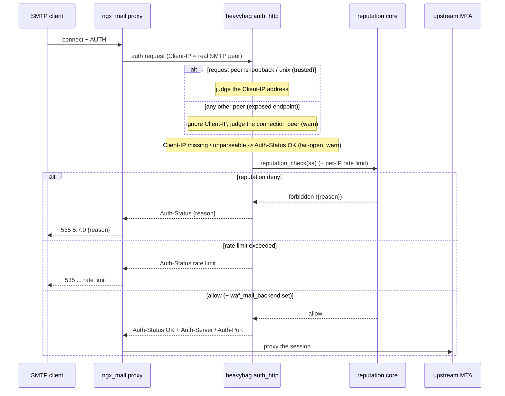
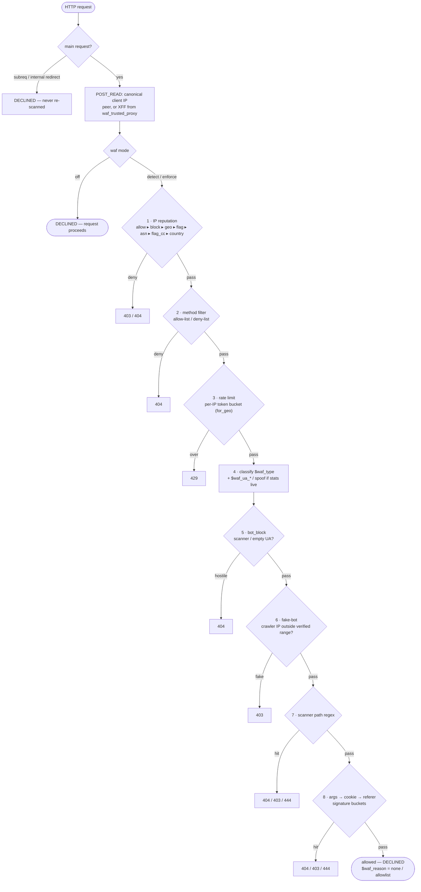

# ngx_http_heavybag_module — an nginx edge firewall

A lean, fast **edge firewall** for vanilla nginx, built as a dynamic C module
plus the stock `ngx_mail` proxy, sharing a single IP-reputation core. It is
*not* a heavy WAF — it is a slim edge filter: scanner path blocking,
User-Agent classification (the `$waf_type` variable), Apache fingerprint
spoofing, embedded nanolibloc geo/reputation filtering (block- **or** allow-list),
and HTTP + SMTP + stream (L4) protection driven by the same reputation engine.

It replaces a legacy `nginx-firewall.conf` (~130 location-based scanner
rules riddled with over-broad prefixes, unanchored substring matches, and
dead rules) with compiled, anchored, hot-reloadable rules.


## Goals & design constraints

- **Edge filtering, not deep inspection.** Block known scanner/bot paths,
  reject bad IP reputation early, and hide the server fingerprint.
- **HTTP/3 (QUIC) + 0-RTT** via native OpenSSL QUIC — this is why OpenSSL
  3.5.x is bundled (the host OpenSSL 3.0.2 is too old for native QUIC).
- **No shared writable state.** Deliberately *out of scope*: custom
  rate-limiting (stock `limit_req`/`limit_conn` suffice), Hyperscan (PCRE2
  with JIT is enough for ~130 rules), a MaxMind/libloc library dependency
  (the geo reader is an embedded nanolibloc adaptation, libc-only), request
  body inspection, dynamic auto-ban, and TLS fingerprint spoofing.
  **Consequence:** there is no slab, no rbtree, no shared memory. The geo
  database is read-only (shared across workers via fork copy-on-write),
  every list/pattern is resolved at configuration time, and workers are
  stateless with respect to each other.
- **One reputation engine, three heads.** The HTTP `PREACCESS` handler, the
  SMTP `auth_http` endpoint, and the stream (L4) `ACCESS` handler all call
  the *same* `ngx_http_heavybag_reputation_check()` on the client IP. The inputs
  live in a shared `ngx_heavybag_rep_conf_t` embedded in each head's config.


## Architecture

One `.so` carries **two** nginx modules (HTTP + stream) plus the mail
`auth_http` content handler. All three entry points ("heads") converge on the
*same* `reputation_check`; the HTTP head adds the request-aware layers (UA
classification, request-field signatures, UA parsing, JA4, fingerprint
spoofing) on top. The geo DB and the two shm zones are the only shared state.



- **Solid arrows** are the per-request control path; **dotted arrows** are the
  request-aware data layers and the shm-counter side effects.
- The **shared core** (`reputation_check`) is stateless across workers: every
  list/pattern resolves at config time, the geo DB is `mmap`'d read-only
  (fork copy-on-write), and the only writable shared state is the two shm zones
  (rate + stats), both lock-free.
- The **HTTP-only layers** never run at L4 (no headers / request line) and the
  mail head is pure IP reputation (+ rate limit) — see the per-head sections
  below.


## Repository layout

```
.
├── CMakeLists.txt               super-build: fetch + build OpenSSL/zlib-ng/nginx
├── cmake/Versions.cmake         pinned PKG_* versions, URLs, SHA256 hashes
├── modules/ngx_http_heavybag/        the dynamic module
│   ├── config                   nginx addon build descriptor (one .so, 2 modules)
│   ├── lists/                   path/field & UA signature lists (hot-reloadable)
│   │   ├── scanners.list           scanner path patterns   -> 404/403/444
│   │   ├── args.list               query-string signatures -> $waf_reason=args
│   │   ├── cookie.list             Cookie-header signatures -> $waf_reason=cookie
│   │   ├── referer.list            Referer-header sigs     -> $waf_reason=referer
│   │   ├── scanner-ua.list         security tools  -> $waf_type=scanner
│   │   ├── ai-crawler.list         LLM/AI crawlers -> $waf_type=ai-crawler
│   │   ├── crawler.list            search engines  -> $waf_type=crawler
│   │   ├── bot.list                social/monitor/HTTP libs -> $waf_type=bot
│   │   ├── ja4.list                JA4 -> coarse TLS family (spoof signal)
│   │   └── verified-crawler.list   published crawler CIDRs (fake-bot check)
│   └── src/
│       ├── ngx_http_heavybag_module.c  HTTP module glue: directives, phases, merge, $waf_* vars
│       ├── ngx_http_heavybag.h         shared HTTP types / loc_conf
│       ├── ngx_http_heavybag_ua_enums.h  UA enum -> string tables
│       ├── heavybag_match.{c,h}         scanner/args/cookie/referer regex buckets + UA classification
│       ├── heavybag_ua_parse.{c,h}      descriptive UA parser ($waf_ua_* variables)
│       ├── heavybag_spoof.{c,h}         Apache Server header + error-page spoof
│       ├── heavybag_geo.{c,h}           IPFire location.db reader (embedded nanolibloc) + ECDSA verify
│       ├── heavybag_ja4.{c,h}           JA4 TLS fingerprint + spoof signal
│       ├── heavybag_rep.h               shared rep_conf + reputation prototypes
│       ├── heavybag_reputation.{c,h}    shared reputation core + config helpers
│       ├── heavybag_rate.{c,h}          lock-free per-IP token-bucket rate limiter
│       ├── heavybag_status.{c,h}        lock-free statistics endpoint (plain/json/prometheus)
│       ├── heavybag_authhttp.{c,h}      ngx_mail auth_http content handler
│       └── heavybag_stream.c            ngx_stream_heavybag_module (L4 reputation head)
├── geodb/
│   ├── location.db              IPFire location database (uncompressed)
├── reference/                   nanolibloc.c (basis), loctest.c (geo oracle), locverify.c (signature oracle), geolookup.c (combined geo+sig oracle)
├── sandbox/                     runnable test env AND the build install prefix
│   ├── nginx.conf               full HTTP + mail example config   (tracked)
│   ├── certs/                   self-signed test cert/key          (tracked)
│   ├── html/                    test documents                     (tracked)
│   ├── sbin/nginx               installed by the build             (generated)
│   ├── modules/*.so             installed by the build             (generated)
│   └── conf/ logs/ *_temp/      nginx runtime dirs                 (generated)
```


## Building

The toolchain is a **CMake super-build**. From a clean checkout it downloads
version-pinned sources (OpenSSL, zlib-ng, nginx), builds them, and installs
the nginx binary + heavybag module into the runnable `sandbox/` tree — no vendored
trees, no manual `./configure` dance.

### Prerequisites

- CMake ≥ 3.16, a C toolchain (gcc/clang), `make`, and network access
  (sources are fetched at build time).
- PCRE2 dev headers (linked dynamically) and the usual nginx build deps.
- Everything else is fetched and built by CMake:
  - **OpenSSL 3.5.7** — built from source and statically linked, because
    native QUIC needs OpenSSL ≥ 3.5 (the host's 3.0.2 is too old). nginx
    builds it in-tree via `--with-openssl=<src>`.
  - **zlib-ng 2.3.3** — built statically (`--zlib-compat --static`) and
    linked in place of the system dynamic zlib.
  - **nginx 1.30.2** — configured with the full flag set and the heavybag module
    as a dynamic add-on.

Versions/URLs/hashes are pinned in [`cmake/Versions.cmake`](cmake/Versions.cmake);
bump a `PKG_*` there (or pass `-DPKG_*_VERSION=…`) to change a dependency.

### One-shot build

```sh
cmake -B build -S .
cmake --build build -j
```

This installs, into the `sandbox/` tree (the nginx prefix), at stable
repo-relative paths:

- `sandbox/sbin/nginx` — the binary (OpenSSL 3.5.7 + static zlib-ng)
- `sandbox/modules/ngx_http_heavybag_module.so` — the heavybag dynamic module

(`sandbox/` doubles as the build install prefix and the runnable test env;
the generated `sbin/`, `modules/`, `conf/`, `logs/`, `*_temp/` are gitignored,
while `nginx.conf`, `certs/`, and `html/` are tracked.)

> **Note — clean-build stamp race.** On a *fresh* checkout the very long
> in-tree OpenSSL compile can make the first `cmake --build` step report a
> spurious non-zero exit before CMake writes its stamp. If that happens, just
> run `cmake --build build -j` **again** — the second pass finds the build
> done and proceeds to `make install`. Incremental builds are unaffected.

### Fast module iteration

Day-to-day module edits should not re-run the whole chain. After the first
full build, rebuild just the `.so` and refresh `sandbox/modules/` with:

```sh
cmake --build build --target heavybag_module
```

It runs `make modules` in the already-built nginx tree and copies the fresh
`ngx_http_heavybag_module.so` into `sandbox/modules/`.

### Verifying the build

```sh
sandbox/sbin/nginx -V                 # OpenSSL 3.5.7, --with-http_v3_module, --with-mail
ldd sandbox/sbin/nginx                # no libz.so -> zlib-ng is static
strings sandbox/sbin/nginx | grep -i zlib-ng
```

### ⚠️ Gotchas (read before you build)

1. **The OpenSSL-rebuild trap (handled).** Re-running nginx's `./configure`
   bumps `objs/Makefile`'s mtime, and the next `make` then tries a *full*
   OpenSSL rebuild. The super-build guards against this: before each nginx
   `make` it touches `<openssl-src>/.openssl/include/openssl/ssl.h` if
   present (a no-op on the first build). You do not need to do this by hand.

2. **A new module source file requires a re-configure.** Adding a `.c` to
   `modules/ngx_http_heavybag/config` is not picked up by the `heavybag_module` fast
   target alone — the nginx tree must be re-configured. Drop the configure
   stamp so the nginx ExternalProject re-runs `./configure` + `make` on the
   next build (without re-downloading the sources):

   ```sh
   rm -f build/nginx_ext-prefix/src/nginx_ext-stamp/nginx_ext-configure
   cmake --build build -j
   ```

   (Or wipe `build/` entirely for a clean, re-downloading run.)

3. **A dynamic `.so` is NOT hot-reloaded.** `nginx -s reload` does not load
   new module *code*. After rebuilding the `.so`, do a full **stop + start**
   of the running nginx. (Config and the scanner list / geo DB *are*
   reloadable — see below; only the compiled module code is not.)


## Configuration

### Loading the module

```nginx
load_module /path/to/sandbox/modules/ngx_http_heavybag_module.so;
```

### Directive reference

The directives below are the **HTTP** set: valid in `http`, `server`, and
`location` contexts, inheriting downward (merge), **except** `waf_mail_auth`,
which is `location`-only. `waf_blocklist`/`waf_allowlist`/`waf_trusted_proxy`
take a single CIDR each but may be repeated to build up a list. The reputation
and geo directives are mirrored in the **stream** context for the L4 head —
see [Stream (L4) protection](#stream-l4-protection). UA classification always
runs and is exposed as the [`$waf_type`](#user-agent-classification-waf_type)
variable, independent of `waf` / `waf_bot_block`.

| Directive | Args | Default | Purpose |
|---|---|---|---|
| `waf` | `off`\|`detect`\|`enforce` (alias `on`) | `enforce` | Mode for the HTTP `POST_READ` + `PREACCESS` handlers (reputation, UA block, scanner, method, ASN). `off` skips them; `enforce` (and the back-compat alias `on`) blocks; **`detect`** runs every check but **never blocks** — it lets the request through (`NGX_DECLINED`) and bumps the `would_block[reason]` counters instead, so you can size a policy before enforcing it. **Fail-closed (CWE-636):** an *unset* `waf` now defaults to **`enforce`** (it used to be `off`), and any value other than `off`/`detect` takes the blocking path. Does **not** gate spoofing or `$waf_type` classification. |
| `waf_bot_block` | `on`\|`off` | `off` | Block only **hostile** User-Agents: `scanner` tools and empty/missing UA (→ 404). `crawler`/`ai-crawler`/`bot` are classified into `$waf_type` but **never** blocked by this flag. |
| `waf_scanner_list` | `<path>` | — | Load scanner **path** patterns from a file (compiled into action buckets). |
| `waf_args_list` | `<path>` | — | Signature patterns matched against the **query string** (`r->args`, %-decoded). Same action-bucketed file format as `waf_scanner_list` (`404`/`403`/`444`) → `$waf_reason=args`. Hot-reloadable. |
| `waf_cookie_list` | `<path>` | — | Signature patterns matched against **every `Cookie`** request header → `$waf_reason=cookie`. Same file format; hot-reloadable. |
| `waf_referer_list` | `<path>` | — | Signature patterns matched against the **`Referer`** header (%-decoded) → `$waf_reason=referer`. Same file format; hot-reloadable. Evaluated after the scanner path, in order args → cookie → referer (first hit wins). |
| `waf_scanner_ua_list` | `<path>` | — | UA signatures for security tools → `$waf_type=scanner`. |
| `waf_ai_crawler_list` | `<path>` | — | UA signatures for LLM/AI crawlers → `$waf_type=ai-crawler`. |
| `waf_crawler_list` | `<path>` | — | UA signatures for search-engine/archival crawlers → `$waf_type=crawler`. |
| `waf_bot_list` | `<path>` | — | UA signatures for social/monitor/feed/HTTP-library clients → `$waf_type=bot`. |
| `waf_fake_bot_block` | `on`\|`off` | `off` | Verify a self-declared crawler really originates from its operator's published IP ranges. When `on`, a request whose `$waf_type` is `crawler`/`ai-crawler` **and** whose class has a `waf_verified_bot` CIDR list configured is blocked **403** when the canonical client IP is **not** inside that list (a fake bot). A class with no list is silently skipped. Independent of `waf_bot_block`; detect-mode-aware (records `would_block[fake_bot]`). See [Verified-bot verification](#verified-bot-fake-bot-verification). |
| `waf_verified_bot` | `<class> <path>` | — | Load the published CIDR allowlist for one verifiable class. `<class>` is `crawler` or `ai_crawler` (any other token is a config error); `<path>` is a plain CIDR-per-line file. Per class; **hot-reloadable**. Used only when `waf_fake_bot_block` is `on`. |
| `waf_ja4_list` | `<path>` | — | Load the JA4-fingerprint → coarse-TLS-family table (`<ja4> <family>` per line; family ∈ `chromium`/`firefox`/`safari`/`tool`/`bot`/`unknown`) consumed by [`$waf_ua_is_spoofed`](#descriptive-ua-variables-waf_ua_). **Optional** — when unset the JA4 half of the spoof signal is inert and `$waf_ua_is_spoofed` degrades to the CIDR-only half. Regenerate offline from a ja4db dump (procedure in the shipped `lists/ja4.list` header). Hot-reloadable. |
| `waf_server_token` | `<string>` | `Apache/2.4.68 (Unix)` | The fake `Server:` token and the error-page fingerprint. |
| `waf_reason_header` | `on`\|`off` | `off` | Stamp the per-request heavybag verdict token (`$waf_reason`: `none`, `scanner_path`, `args`, `fake_bot`, …) onto the response as `X-WAF-Reason`. **OFF by default — production must not disclose which rule matched** (it aids evasion). Intended for the detect-mode replay/test harness, where it gives per-request verdict attribution on the wire. Independent of `waf` mode (renders `none` when no verdict was resolved). |
| `waf_geo_db` | `<path>` | — | Path to the IPFire `location.db` (mmap'd read-only; read by the embedded nanolibloc adaptation, no libloc dependency). |
| `waf_geo_block` | `<CC> …` | — | Block these country codes (ISO-3166 two-letter, plus IPFire specials A1/A2/A3/T1/XD) → 403. |
| `waf_asn_block` | `<ASN> …` | — | Block these autonomous systems (decimal, 1..4294967295) when the client IP resolves to one via the geo DB → 403. `asn==0` / no record fails open. Repeatable / multi-arg. |
| `waf_method_allow` | `<METHOD> …` | — | **Whitelist:** only the listed HTTP methods pass; every other method → 404. Standard methods (GET, HEAD, POST, PUT, DELETE, OPTIONS, PATCH, TRACE, the WebDAV verbs, …) map to nginx's method bits; non-standard names (e.g. TRACK) are matched verbatim. Wins over `waf_method_deny`. |
| `waf_method_deny` | `<METHOD> …` | — | **Blacklist:** the listed methods → 404; everything else passes. (Note: nginx core may reject `TRACE` before the WAF, depending on its `allow_special_method` / `limit_except` configuration.) |
| `waf_geo_whitelist` | `<CC> …` | — | **Allow only** these countries; every other country and any IP with no geo record → 404. Wins over `waf_geo_block`. Repeatable / multi-arg. |
| `waf_flag_block` | `<flag> …` | — | Block by libloc network flag: `anonymous-proxy` (alias `anon`), `satellite`, `anycast`, `tor`, `drop`. |
| `waf_trusted_proxy` | `<cidr>` | — | Trust `X-Forwarded-For` only from these peers when deriving the canonical client IP. |
| `waf_blocklist` | `<cidr>` | — | Statically deny this network (→ 403). Repeatable. |
| `waf_allowlist` | `<cidr>` | — | Allow this network, short-circuiting all reputation checks. Repeatable. |
| `waf_rate_zone` | `size=<size>` | — | **`http` (main) only.** Declare the single process-wide per-IP rate-limit shared-memory zone (min 8 pages). One zone, keyed by client IP only, shared by every `waf_rate_limit`/`waf_stream_rate_limit` rule and by the stream + mail heads. Must be declared **before** any `waf_rate_limit`. See [Rate limiting](#rate-limiting-token-bucket). |
| `waf_rate_limit` | `rate=Nr/s\|Nr/m\|Nr/h [burst=N] [for_geo=CC,…]` | — | Per-IP token-bucket limit; over the limit → **429**. `rate` is the steady refill, `burst` the bucket capacity (default = one period's worth). Repeatable: at most **one default** rule (no `for_geo`) plus any number of country-scoped `for_geo` overrides. Detect-mode-aware (`would_block[rate_limit]`). Requires `waf_rate_zone`. |
| `waf_mail_auth` | *(none)* | — | Turn this `location` into the `ngx_mail` `auth_http` endpoint. |
| `waf_mail_backend` | `<ip> <port>` | — | Upstream MTA returned as `Auth-Server`/`Auth-Port` on allow. **Numeric IP only** (the mail proxy cannot resolve hostnames). |
| `waf_status` | *(none)* | — | `location`-only. Turn this `location` into the lock-free statistics endpoint (see [Statistics / status endpoint](#statistics--status-endpoint)). Wrap it in an access-restricted location. |

### Scanner list file format

One PCRE2 pattern per line, with an optional trailing action token:

```
<pattern>[ <action>]        # action ∈ { 404 (default), 403, 444 }
```

- Lines are trimmed; blank lines and `#` comments are ignored.
- **Anchor every pattern with `^`.** Patterns match the normalized request
  URI (`r->uri`) case-insensitively; an unanchored pattern can match
  mid-URI and block legitimate paths.
- Patterns sharing an action are concatenated into **one** anchored
  alternation regex and JIT-compiled once, so matching is a single regex
  exec per action bucket at request time — not one exec per pattern.
- Actions map to: `404` → `NGX_HTTP_NOT_FOUND`, `403` → `NGX_HTTP_FORBIDDEN`,
  `444` → `NGX_HTTP_CLOSE` (drop the connection).
- The file is **hot-reloadable**: `nginx -s reload` re-reads and recompiles
  it; the old regex is freed with the old config pool.
- The **same file format** (including the `404`/`403`/`444` action tokens)
  applies to the request-field signature lists `waf_args_list` /
  `waf_cookie_list` / `waf_referer_list` — they match the query string / the
  `Cookie` header(s) / the `Referer` header (each %-decoded) instead of the URI.

Example:

```
^/wp-
^/xmlrpc\.php$
^/\.git
^/phpmyadmin/ 403
^/owa 444
```

### User-Agent classification (`$waf_type`)

Every request's `User-Agent` is classified into exactly one bucket, exposed
as the **`$waf_type`** nginx variable. Classification is **decoupled from
blocking**: it always runs (even under `waf off`), and the operator decides
what to do with each class.

| `$waf_type` | Source | Blocked by `waf_bot_block`? |
|---|---|---|
| `scanner` | `waf_scanner_ua_list` (sqlmap, nikto, nmap, nuclei, …) | **yes** → 404 |
| `ai-crawler` | `waf_ai_crawler_list` (GPTBot, ClaudeBot, CCBot, Bytespider, …) | no (flag-only) |
| `crawler` | `waf_crawler_list` (Googlebot, bingbot, Baiduspider, …) | no (flag-only) |
| `bot` | `waf_bot_list` (facebookexternalhit, curl, python-requests, …) | no (flag-only) |
| `regular` | no signature matched (assume human) | no |
| `empty` | missing / empty `User-Agent` | **yes** → 404 |

Lists are matched in **priority order** scanner → ai-crawler → crawler → bot;
the first hit wins (so `Applebot-Extended` resolves to `ai-crawler`, not the
`Applebot` token in `crawler.list`). `spider` is **not** a separate class —
industry practice treats spider ≡ crawler, so spider tokens live in
`crawler.list`.

**UA list file format** — one case-insensitive PCRE2 fragment per line; blank
lines and lines starting with `#` are ignored; the whole trimmed line is the
pattern. Note there is **no** action token and **no inline comments** (`#`
only starts a comment at the beginning of a line). Each list compiles to one
alternation regex (a single exec per category) and is **hot-reloadable**.

```
# bot.list (excerpt) -- full-line comments only, one fragment per line
facebookexternalhit
python-requests
curl/
^Java/
Apache-HttpClient
```

In the excerpt above, `curl/` matches `curl/8.5.0` (the `/` is a literal), and
`^Java/` anchors at the start of the UA so it matches `Java/1.8` but not a
browser that merely mentions "java" elsewhere.

> **Watch-outs.** Tokens are regex fragments: `.` and `/` are significant
> (escape `\.` for a literal dot when you need precision — over-matching is
> usually harmless). **Never** seed a bare `bot`, `spider`, `crawl`, or
> `Mozilla` token — they false-positive on legitimate clients and on each
> other. Use the distinctive product/library name.

The `$waf_type` variable is `NOCACHEABLE` and works in `if`, `add_header`,
`log_format`, `map`, etc. — use it to tag, route, or rate-limit by class
without blocking:

```nginx
# surface the classification to upstreams / logs
add_header X-WAF-Type $waf_type always;
proxy_set_header X-Client-Class $waf_type;

# e.g. send AI crawlers to a thin/204 location instead of blocking them
if ($waf_type = ai-crawler) { return 204; }
```

Seed lists ship in [`modules/ngx_http_heavybag/lists/`](modules/ngx_http_heavybag/lists/),
distilled from Matomo `bots.yml`, monperrus/crawler-user-agents,
ai.robots.txt, and CrawlerDetect. They drift (AI crawlers especially) — a
config reload recompiles them, so updates are a reload, not a rebuild.

### Verified-bot (fake-bot) verification

UA classification alone trusts the client's word: anyone can send
`User-Agent: Googlebot`. Real crawlers publish the IP ranges they originate
from; impersonators do not. With `waf_fake_bot_block on` and a `waf_verified_bot`
list for the class, the `PREACCESS` phase blocks (**403**) a request that *claims*
to be a `crawler`/`ai-crawler` but whose canonical client IP is **outside** the
published range.

The check is **fully stateless**: no reverse/forward DNS, no per-IP cache, no
request-path I/O. The published ranges are downloaded **offline** (a cron job
converts e.g. Google's `googlebot.json` into a plain CIDR list) and loaded once
at config time, then matched with nginx's built-in `ngx_cidr_match`. It runs
*after* the `waf_bot_block` UA gate and *before* the scanner-path scan.

```nginx
waf_fake_bot_block on;
waf_verified_bot   crawler    /etc/nginx/lists/verified-googlebot.list;
waf_verified_bot   ai_crawler /etc/nginx/lists/verified-ai.list;
```

**Verified-bot CIDR file format** — one `addr/prefix` per line; blank lines and
lines starting with `#` are ignored. Producing the file (JSON → CIDR) is the
offline cron's job, never heavybag's.

```
# verified-googlebot.list (excerpt)
66.249.64.0/19
2001:4860:4801::/48
```

- **Class token** is `crawler` or `ai_crawler` (underscore — the config token,
  distinct from the hyphenated `$waf_type` value `ai-crawler`). Any other token
  is a hard config error.
- **Empty / comments-only file** → the class is left **unconfigured and silently
  skipped** (it is never a zero-element "block everything" allowlist). A
  **malformed CIDR line** aborts the reload (the old config stays live) — it
  never degrades to a permissive state.
- **Staged rollout:** run a newly-added class under `waf detect` first — it
  records `would_block[fake_bot]` without blocking, so you can prove the list is
  complete before enforcing.
- **`waf_allowlist` does *not* exempt a fake bot.** The allowlist short-circuits
  the reputation head only; an allowlisted IP that sends `User-Agent: Googlebot`
  from outside the verified range is still 403'd. Allowlist governs *who*, this
  check governs *UA honesty* — they are orthogonal.
- **XFF is load-bearing here.** Because this now gates an **allow** decision on
  the client IP, the canonical IP must be trustworthy: it is XFF-derived only
  when the connection peer is in [`waf_trusted_proxy`](#configuration) (recursive
  walk). List **only** genuinely controlled CDN/LB ranges there, and have the
  front proxy *overwrite* (not append) the client `X-Forwarded-For` — otherwise a
  spoofed leftmost address could be honoured. A direct attacker who is *not*
  behind a trusted proxy cannot influence the IP and is correctly blocked.
- **Cost.** `ngx_cidr_match` is O(n) per request. Googlebot/Bingbot ranges are
  tiny (negligible). `ai_crawler` published lists can be large, and
  `User-Agent: GPTBot` spam forces the full scan — an accepted, opt-in trade-off;
  revisit only if a list grows past a few hundred CIDRs.

### Verdict variables (`$waf_country`, `$waf_reason`)

Two further `NOCACHEABLE` log variables sit alongside `$waf_type`, sharing the
same per-request verdict decision (so there is at most **one** geo lookup per
request even when geo blocking, the per-country counter and `$waf_country` are
all active):

| Variable | Value |
|---|---|
| `$waf_country` | The client's ISO-3166 two-letter geo country (or an IPFire special A1/A2/A3/T1/XD). Resolves to *not found* (`-` in logs) when no geo record exists or `waf_geo_db` is unset. |
| `$waf_asn` | The client's autonomous-system number (decimal) from the geo DB. *Not found* (`-`) when `asn==0`, no record, or `waf_geo_db` is unset. Shares the per-request geo lookup, so it costs no extra DB hit. |
| `$waf_reason` | The verdict token: `none` (allowed), `allowlist`, `blocklist`, `geo`, `geo_whitelist`, `flag`, `scanner_ua`, `empty_ua`, `scanner_path`, `asn`, `method`, `args`, `cookie`, `referer`, `fake_bot`, `rate_limit`. In `detect` mode it carries the *would-be* reason. |
| `$waf_ja4_hash` | The [JA4](https://github.com/FoxIO-LLC/ja4) TLS client fingerprint (`t13d1516h2_…_…`), computed at the TLS handshake. **Observability only — never blocks.** *Not found* on plain HTTP / non-TLS. Works for TCP-TLS (HTTP/1.1, H2) and QUIC/H3 (the `q…` form). |

```nginx
log_format waf '$remote_addr $status type=$waf_type '
               'country=$waf_country asn=$waf_asn reason=$waf_reason '
               'ja4=$waf_ja4_hash';
access_log /var/log/nginx/access.log waf;
```

### Descriptive UA variables (`$waf_ua_*`)

A second, independent UA layer parses the User-Agent into five more
`NOCACHEABLE` variables. It **only produces data** — it makes no blocking
decision; the consumer (config `map`/`if`/`return`) decides. The parse is lazy
(once per request) and allocation-free: four values are static enum-table
strings and the version is a zero-copy slice into the UA, charset-restricted to
`[0-9A-Za-z._-]` at the source (so it can never carry CR/LF/quote/control-char
injection into a log or response-header sink).

| Variable | Value |
|---|---|
| `$waf_ua_browser` | Browser/client family: `chrome`, `firefox`, `safari`, `edge`, `opera`, `operagx`, `yabrowser`, `samsung`, `vivaldi`, `headlesschrome`, `duckduckgo`, `huaweibrowser`, `ucbrowser`, `whale`, `msie`, `xiaomibrowser`, `sleipnir`, `androidbrowser`, `silk`, `curl`, `wget`, `ffmpeg`, `applecoremedia`, `libmpv`, `python`, `gohttp`, `java`, `okhttp` (`unknown` if none matched). Chromium-derivative tokens are detected **before** the bare `Chrome/` token. Brave/Arc ship a Chrome-identical UA and are reported as `chrome` (undetectable server-side). |
| `$waf_ua_browser_version` | The version token following the browser marker (e.g. `120.0.0.0`). *Not found* (`-`) when absent. Chromium froze the minor/patch at `0.0.0`, so only the major is reliable for Chromium browsers. |
| `$waf_ua_category` | Device class `mobile`/`tablet`/`pc`/`tv`/`console`, **overridden** by the threat class `scanner`/`ai-crawler`/`crawler`/`bot` when `$waf_type` matched one. `unknown` otherwise. |
| `$waf_ua_vendor` | `apple`/`google`/`microsoft`/`mozilla`/`yandex`/`samsung`/`opera`/`huawei`/`naver`/`duckduckgo`/… plus crawler-vendor attribution (Googlebot→`google`, bingbot→`microsoft`, Baiduspider→`baidu`, …). `unknown` otherwise. |
| `$waf_ua_is_spoofed` | `"1"` when the UA contradicts the TLS/network evidence, else `"0"`. Two signals OR'd: **(a) JA4** — a TLS request whose JA4 coarse family (looked up in `waf_ja4_list`) contradicts the family the UA browser should present (the unforgeable, HTTPS-only half); **(b) CIDR** — a UA claiming a verified-bot class whose client IP is outside that class's `waf_verified_bot` range. Both signals are conservative (an unknown/ambiguous JA4 or an unmapped browser never triggers). |

```nginx
waf_ja4_list /etc/nginx/lists/ja4.list;     # optional; enables the JA4 spoof half

log_format waf_ua '$remote_addr browser=$waf_ua_browser ver="$waf_ua_browser_version" '
                  'cat=$waf_ua_category vendor=$waf_ua_vendor '
                  'spoofed=$waf_ua_is_spoofed';

# Example: drop obvious UA spoofing at the edge (config decides, not the module)
if ($waf_ua_is_spoofed) { return 403; }
```

> **Operator caveat (advisory variable):** do **not** gate authentication/access
> decisions on `$waf_ua_is_spoofed` on plain-HTTP or untrusted-`X-Forwarded-For`
> deployments. The CIDR half is only trustworthy behind a correctly-configured
> `set_real_ip_from`/trusted-proxy (it shares the exact trust boundary as the
> existing fake-bot block, CWE-290); the JA4 half (HTTPS-only) is the unforgeable
> one. Known UA-only blind spots: Brave/Arc (Chrome-identical UA), and
> iPadOS/visionOS desktop-Safari masquerade.

### Detect mode & config-level blocking

`waf detect;` (and `waf_stream detect;`) runs every check but **lets the request
through**, recording what it *would* have blocked in the `would_block[reason]`
counters (see [Statistics](#statistics--status-endpoint)). Use it to size a new
policy against live traffic before flipping to `enforce`:

```nginx
waf detect;            # observe only; nothing is blocked
waf_geo_block CN RU;   # would-be 403s land in would_block[geo], not blocked[geo]
```

For blocking decisions the module itself does not make, drive them from the
log variables at the **config** level with a `map` (cheaper and more flexible
than chained `if`s). For example, deny by UA class and surface a would-be geo
verdict without the built-in 403:

```nginx
# map the classification/verdict to a deny flag, then act on it once
map $waf_type $waf_deny {
    default      0;
    scanner      1;
    ai-crawler   1;          # block AI crawlers at the edge, say
}

server {
    waf detect;              # the module observes; the map enforces
    if ($waf_deny) { return 403; }
}
```

Prefer a `map` over `if ($waf_country = CN)` chains: `map` is evaluated once,
lazily, and composes cleanly with `$waf_asn` / `$waf_reason` / `$waf_ja4_hash`.

### Geo / reputation

The geo database is the **IPFire location** database (`location.db` format, read by the embedded nanolibloc adaptation — no libloc library dependency). Fetch and decompress it:

```sh
curl -fsSL -o geodb/location.db.xz \
    https://location.ipfire.org/databases/1/location.db.xz
xz -dk geodb/location.db.xz       # -> geodb/location.db
```

Reputation is evaluated in this fixed order (allowlist wins over everything;
the first deny wins):

1. **allowlist** match → allow (short-circuit).
2. **blocklist** match → 403 (`static blocklist`).
3. **no geo record** → allow — **unless** a whitelist is set, then 404
   (`geo not whitelisted`).
4. **geo network flag** match (`flag_mask`) → 403 (`network flag`). Applies in
   both block and whitelist modes.
5. **ASN** match (`waf_asn_block`) → 403 (`asn`). `asn==0` / no record fails
   open. Applies in both block and whitelist modes.
6. **special-source country** match → 403 (`network flag`). The IPFire special
   codes that `waf_flag_block` maps from network flags (A1/A2/A3/T1/XD — see
   the mapping below) are matched here against the source CC, **before** the
   country decision and in **both** block and whitelist modes — so a flagged
   source is denied even from an otherwise-whitelisted country.
7. **geo country**:
   - **block mode** (`waf_geo_block`): country in the block list → 403
     (`geo country`).
   - **whitelist mode** (`waf_geo_whitelist`, which *wins* when set): country
     **not** in the allow list → 404 (`geo not whitelisted`); `block_cc` is
     not consulted for the country decision.



The flag / ASN / special-source-CC steps run **before** the country decision
and apply in **both** modes, so a flagged or blocklisted source is denied even
from an otherwise-whitelisted country.

The code split is deliberate: **403** for an explicit deny (blocklist / flag /
geo-block), **404** for a whitelist miss — hide the resource so the client
cannot tell it is geo-gated. A geo-DB miss in whitelist mode is also a 404.
The CIDR blocklist and the network-flag check still run **first**, so a
flagged or blocklisted IP is denied even from a whitelisted country.

The database is `mmap`'d read-only and `munmap`'d on reload, so updating
it is a config reload — replace `geodb/location.db` atomically and run
`nginx -s reload` (no restart needed for a DB swap).

#### Signature verification (load-time, fail-closed)

The `location.db` is **cryptographically verified at load time**, every config
parse/reload, before any block offset in it is trusted. libloc embeds an
**ECDSA P-521 / SHA-512** signature in the database header; heavybag reproduces
libloc's `loc_database_verify` with OpenSSL (already linked for JA4 — **no
libloc dependency**) against the **pinned IPFire signing public key**
(secp521r1, stable since 2019), which is compiled into the module — there is no
directive and no opt-out.

The check is **mandatory and fail-closed**: an **unsigned**, **tampered**, or
**truncated/corrupted** DB — or any OpenSSL error — makes `ngx_http_heavybag_geo_open`
return `NGX_CONF_ERROR`, so **`nginx -t` fails and nginx refuses to start or
reload** (the previous config keeps running on a failed reload). The signature
is dual-slot for key rotation: either slot validating is accepted, and neither
is forgeable without IPFire's private key. A genuine **key rotation (multi-year
horizon) requires rebuilding this module** with the new pinned key.

Cost is **config-time only** — one SHA-512 pass over the DB (~60 MB today) per
load/reload, with **zero request-path impact**. Oversized files are rejected by
a size cap (512 MiB) before `mmap`, so a hostile or runaway DB cannot stall a
reload by being hashed first.

`waf_flag_block` is a convenience: each flag also adds the corresponding
IPFire special country code to the block list (`anonymous-proxy`→A1,
`satellite`→A2, `anycast`→A3, `drop`→XD). `tor` adds only the T1 country
code (Tor exits carry no dedicated flag bit). Note: the public IPFire DB
does not populate every special CC (e.g. Tor/T1 is typically absent).

### Client IP behind a proxy

With `waf_trusted_proxy` set and an `X-Forwarded-For` header present, the
`POST_READ` handler derives the canonical client address from XFF — but
**only** when the socket peer is itself a trusted proxy. Otherwise the
socket peer is used. The reputation check runs against this canonical
address.

### Mail (SMTP) protection

The stock `ngx_mail` proxy authenticates connections against an `auth_http`
endpoint. This module serves that endpoint: it reads the `Client-IP`
request header (the real SMTP peer, injected by `ngx_mail` from
`s->connection->addr_text` — unspoofable), runs the shared
`reputation_check`, and returns a header-only response:

- **Allow:** `Auth-Status: OK` + `Auth-Server`/`Auth-Port` (from
  `waf_mail_backend`). Both are mandatory; if `waf_mail_backend` is unset the
  response is sent without them and an error is logged, so `ngx_mail` rejects
  the session.
- **Deny:** `Auth-Status: <reason>` — `ngx_mail` prepends its SMTP error
  code, e.g. `535 5.7.0 static blocklist`.
- **Fail-open:** missing/unparseable `Client-IP` → allow + a warning log,
  so a format error cannot break the whole mail flow.
- **Trusted-peer gate:** the `Client-IP` header is honoured **only** when the
  auth request itself arrives from a loopback peer (`127.0.0.0/8`, `::1`) or a
  Unix socket. From any other peer the header is ignored and the *connection*
  peer is judged instead, with a warning — so a wrongly-exposed endpoint cannot
  be steered by a spoofed `Client-IP`. This is why the endpoint must stay bound
  to `127.0.0.1`.
- **Rate limit:** the mail head also runs the shared per-IP token-bucket
  limiter — any `waf_rate_limit` rule on the auth `location` applies. Over the
  limit it answers `Auth-Status: rate limit` and bumps the same
  `http_blocked_rate_limit` / `http_resp_429` counters as the HTTP head.
  Requires a `waf_rate_zone` declared in `http{}` (else it fail-opens).



**Critical:** the `auth_http` `location` must be on a server/location with
`waf off`. Otherwise the HTTP `PREACCESS` handler runs against the
*connection* peer (the loopback mail proxy) and can 403 the auth request
before the content handler runs. With `waf off`, `PREACCESS`/`POST_READ`
skip, but the content handler's `reputation_check` still uses the
location's `waf_blocklist`/`waf_geo_*` data (reputation is independent of
the `waf` flag). Bind the endpoint to `127.0.0.1` so it cannot be called
externally.

### Stream (L4) protection

The third head, `ngx_stream_heavybag_module`, guards **raw TCP/UDP** stream
connections — not application traffic. It ships in the *same* `.so` as the
HTTP module (one `load_module`, see [the build descriptor](modules/ngx_http_heavybag/config));
nginx must be built `--with-stream` (it is, in this repo).

At the stream `ACCESS` phase it runs the shared `reputation_check` on the
connection **peer** (`s->connection->sockaddr`) and closes the connection
(`NGX_STREAM_FORBIDDEN`) on any non-allow verdict. There is **no
X-Forwarded-For at L4** — the peer address is used verbatim (already rewritten
by the stream realip / `proxy_protocol` machinery if you configured it).
Trusted-proxy / XFF handling is HTTP-only.

The directives live in the `stream` / `server` (stream) context and reuse the
same reputation/geo semantics as the HTTP head:

| Directive | Args | Purpose |
|---|---|---|
| `waf_stream` | `off`\|`detect`\|`enforce` (alias `on`) | Mode for the stream `ACCESS` handler. `detect` allows the connection but bumps `stream_would_block[reason]`. **Fail-closed:** unset defaults to `enforce`. |
| `waf_geo_db` | `<path>` | IPFire `location.db` for this stream head (mmap'd read-only). |
| `waf_geo_block` | `<CC> …` | Block these countries → connection dropped. |
| `waf_asn_block` | `<ASN> …` | Block these autonomous systems → connection dropped. |
| `waf_geo_whitelist` | `<CC> …` | Allow only these countries (and known IPs); else dropped. Wins over `waf_geo_block`. |
| `waf_flag_block` | `<flag> …` | Block by libloc network flag (`anycast`, `anonymous-proxy`, …). |
| `waf_blocklist` | `<cidr>` | Statically deny this network. Repeatable. |
| `waf_allowlist` | `<cidr>` | Allow this network, short-circuiting reputation. Repeatable. |
| `waf_stream_rate_limit` | `rate=Nr/s\|Nr/m\|Nr/h [burst=N] [for_geo=CC,…]` | Per-IP token-bucket limit at L4; over the limit → connection dropped. Same syntax/semantics as the HTTP `waf_rate_limit`; **the backing zone is the HTTP head's `waf_rate_zone`**, so a `waf_rate_zone` must be declared in `http{}` (if absent the check fail-opens). Detect-mode-aware (`stream_would_block[rate_limit]`). |

There is no UA / scanner / spoofing in the stream head — L4 has no headers or
request line; it is pure IP reputation. A denied verdict is logged as
`heavybag: stream reputation block (<reason>)`.

```nginx
stream {
    waf_geo_db     /etc/nginx/geodb/location.db;
    waf_flag_block anycast;

    server {
        listen        9000;
        waf_stream    on;
        waf_blocklist 203.0.113.0/24;   # dropped at the ACCESS phase, pre-proxy
        proxy_pass    backend:5432;     # e.g. shield a database / SMTP / game port
    }
}
```

### Rate limiting (token bucket)

The one stateful feature: a fixed-size, **lock-free**, open-addressed per-IP
table in a single shared zone — modelled on the per-country counter table, not
nginx's `limit_req` (rbtree + mutex). Each slot holds a 64-bit key (FNV-1a of
the client address) and a 64-bit packed token-bucket state, mutated only with
bounded atomic compare-and-swap. No locks, no slab churn on the hot path.

**Algorithm — token bucket (leaky-bucket / smooth rate).** Each rule has a
steady refill `rate`, a `burst` capacity and a period. A request consumes one
token; refill is continuous (`added = elapsed_ms × rate ÷ period`). Empty
bucket → deny (HTTP **429**, no `Retry-After`; the L4 head drops the
connection; the mail head answers `Auth-Status: rate limit`). A fresh slot
starts **full** (a full burst is allowed immediately).

```nginx
http {
    waf_rate_zone size=16m;            # ONE zone, declared before any use

    server {
        location /api/ {
            waf_rate_limit rate=10r/s burst=20;        # default rule
            waf_rate_limit rate=2r/s  burst=5 for_geo=CN,RU;  # stricter for CN/RU
        }
        location /login {
            waf_rate_limit rate=5r/m burst=3;          # 5/min, allow a burst of 3
        }
    }
}
```

**`rate` syntax:** `Nr/s`, `Nr/m`, `Nr/h` (per second / minute / hour). `burst`
defaults to one period's worth (`N`). Internally rates are fixed-point
(×1000) so a slow rate such as `1r/h` does **not** truncate to zero. `rate`
and `burst` are each capped at ~4.29M so the 64-bit refill math provably never
overflows.

**`for_geo` (reputation-aware).** A rule with `for_geo=CC,…` applies only when
the client's geo country (from `waf_geo_db`) is in the list; the first matching
`for_geo` rule wins, otherwise the single default rule (no `for_geo`) applies.
With no geo DB — or an IP with no geo record — only the default rule can match.
At most one default rule per location.

**One bucket per IP, shared everywhere.** There is a *single* zone keyed by the
client IP **only** — not by location or rule. Every `waf_rate_limit` /
`waf_stream_rate_limit` across all locations, plus the L4 and SMTP-auth heads,
share the *same* per-IP bucket; each call merely applies its own rate/burst to
it. This is an intentional unified per-IP budget across L4+L7, not a
per-endpoint limit (use separate endpoints' rules to tune the rate, not to get
separate buckets).

**IPv6 is keyed on the /64 prefix** (the low 64 bits are an attacker-rotatable
host part, so per-/128 keying would be trivially evaded). IPv4 and v4-mapped
IPv6 share one key. Intra-/64 collateral throttling is the intended
anti-evasion default.

**Eviction-on-full, never a silent drop.** When the probe window is full the
oldest slot is taken over rather than dropping the sample — a saturating
attacker evicts *itself* and the limit stays live for every active IP. A lost
eviction race fails **open** (never a false ban); the `rate_overflow` /
`heavybag_rate_overflow_total` counter exposes saturation.

**Fail-open contract.** A missing zone, an unsupported address family, or CAS
starvation all return *allow* — the limiter never produces a false-positive
ban. Stream rate limiting therefore needs `waf_rate_zone` declared in `http{}`;
without it the L4 check silently fail-opens.

**Trusted client IP.** The limit keys on the same canonical client address the
rest of heavybag uses: the socket peer, or the `X-Forwarded-For` client **only**
from a `waf_trusted_proxy` (HTTP), or the mail proxy's `Client-IP` **only** from
a loopback/unix peer (SMTP-auth). A spoofed `X-Forwarded-For` from an untrusted
peer cannot earn a fresh bucket.

**Reload.** The token state lives in the shm zone and is **preserved** across a
`nginx -s reload` (live limits are not reset). Resizing `waf_rate_zone`
requires a full restart (nginx shm size-conflict). A binary swap needs
stop+start (a reload does not reload module code).

A rate-limit verdict surfaces as `$waf_reason=rate_limit` and is counted in
every status format (`http_blocked_rate_limit`, `http_resp_429`,
`stream_denied_rate_limit`, `rate_overflow`, and their `would_block` variants in
detect mode).

### Statistics / status endpoint

`waf_status;` turns a `location` into a lock-free statistics endpoint, analogous
to `stub_status`. All workers share **one** always-on shared-memory zone of
`ngx_atomic_t` counters; the request hot path only ever does an atomic add (no
slab, no rbtree, no mutex), and the counters are **bounded by construction**
(a closed-set country table, a config-time per-vhost array) — never per-IP.

The handler runs in the **content phase**, *after* the access phase, so an
`allow`/`deny` on the location is enforced before any counter is rendered.
Restrict it — the endpoint exposes operational counters only (no client IPs,
no PII), but it should not be world-readable:

```nginx
location /waf/stat {
    waf_status;
    allow 127.0.0.1;
    allow 10.0.0.0/8;     # your monitoring network
    deny  all;
}
```

The **last path segment** selects the format (default `plain`); only `GET` and
`HEAD` are accepted (else `405`):

| URL | Format | Content-Type |
|---|---|---|
| `/waf/stat/plain` (or any unknown suffix) | `stub_status`-style `key value` lines | `text/plain` |
| `/waf/stat/json` | nested JSON object (RFC 8259) | `application/json` |
| `/waf/stat/prometheus` | Prometheus text exposition | `text/plain` |

```console
$ curl -s http://127.0.0.1/waf/stat/prometheus | head
heavybag_up 1
heavybag_uptime_seconds 3812
heavybag_http_requests_total 19443
heavybag_http_blocked_total{reason="blocklist"} 51
heavybag_http_blocked_total{reason="scanner_path"} 1208
heavybag_http_blocked_total{reason="flag",flag="anycast"} 17
heavybag_country_blocked_total{country="CN"} 904
```

What is tracked: global HTTP verdict counters (requests / allowed / allowlist
hits / blocked-per-reason), the **`would_block`-per-reason** counters bumped by
`detect` mode (`http_would_block_*` / `heavybag_http_would_block_total{reason=…}`),
the scanner-path 404/403/444 split, response-code
counters, the `$waf_type` UA distribution, the descriptive **`$waf_ua_category` distribution** (`http_ua_cat_*` / `heavybag_ua_cat_total{category=…}`) and the **`$waf_ua_is_spoofed` count** (`http_ua_spoofed` / `heavybag_ua_spoofed_total`), the per-flag breakdown, a bounded
open-addressed **per-country** table (total + blocked, with a `cc_overflow`
guard), a **per-vhost** block breakdown (labelled by `server_name`), the STREAM
(L4) globals (`stream_connections_total` / `stream_allowed` /
`stream_denied`-per-reason, plus `stream_would_block`-per-reason), and a geo-DB
health block (network count + mapped size only — **never** the database path).
The `asn` and `method` reasons render automatically in every per-reason loop
(blocked, would_block, per-vhost) across all three formats. When nginx is built with
`--with-http_stub_status_module`, the core connection table
(`active`/`reading`/`writing`/`accepted`/…) is re-exported too.

**Metric names differ by format.** The `plain` output uses flat keys
(`http_requests`, `http_resp_429`, `http_blocked_blocklist`, …); `prometheus`
uses labelled metric families (`heavybag_http_requests_total`,
`heavybag_http_responses_total{code="429"}`,
`heavybag_http_blocked_total{reason="blocklist"}`, …); `json` nests the same
counters under typed objects. The per-reason set (including `asn`, `method`,
`rate_limit`) renders automatically in all three.

All attacker-influenceable bytes (geo-DB country codes, `server_name` values)
are **escaped unconditionally** at the serializer boundary — JSON per RFC 8259,
Prometheus label values per the text-exposition rules — so a hostile geo
database or an odd `server_name` cannot break or inject into the output.

Counters live in the shm zone, so they **survive `nginx -s reload`** as long as
the `server{}` count is unchanged (the zone size is derived from it; changing
the count forces a fresh segment and resets the counters). A rebuilt `.so`
still needs a full stop+start — `-s reload` does not reload module code.

### Example configuration

A complete, runnable example lives in [`sandbox/nginx.conf`](sandbox/nginx.conf).
It wires up all three heads: heavybag on a public HTTP/2 + HTTP/3 server
(ports 8080/8443) with the four UA lists loaded, an `X-WAF-Type $waf_type`
test header, and a `location = /geo-whitelist` demoing whitelist mode; a
localhost-only `auth_http` endpoint (8081); two SMTP heads — an inbound MX
(`smtp_auth none`, pure IP reputation) and a submission listener (STARTTLS +
SMTP AUTH); and a `stream {}` block with two L4 servers (`:9090` blocklisted
→ dropped, `:9091` allowlisted → proxied). The sandbox uses high ports
(2525/5870, 8080/8443/9090) because the test nginx runs unprivileged;
**production binds 25/587** (needs root or `CAP_NET_BIND_SERVICE`).

Minimal HTTP example:

```nginx
load_module .../sandbox/modules/ngx_http_heavybag_module.so;

http {
    waf               on;
    waf_bot_block     on;
    waf_scanner_list  /etc/nginx/lists/scanners.list;

    # UA classification ($waf_type) — always on, blocking is separate
    waf_scanner_ua_list /etc/nginx/lists/scanner-ua.list;
    waf_ai_crawler_list /etc/nginx/lists/ai-crawler.list;
    waf_crawler_list    /etc/nginx/lists/crawler.list;
    waf_bot_list        /etc/nginx/lists/bot.list;

    waf_geo_db        /etc/nginx/geodb/location.db;
    waf_geo_block     CN RU;                 # block mode (403); or, instead:
    # waf_geo_whitelist HU DE;               # allow-only mode (else 404)
    waf_flag_block    anycast anonymous-proxy;
    waf_trusted_proxy 127.0.0.1;

    server {
        listen 443 ssl;
        listen 443 quic reuseport;
        http2  on;
        # ...
        location / {
            add_header Alt-Svc    'h3=":443"; ma=86400';
            add_header X-WAF-Type $waf_type always;   # surface the class
        }
    }
}
```


### Smoke tests

Against the running sandbox (`sandbox/sbin/nginx -p <abs>/sandbox/ -c
<abs>/sandbox/nginx.conf`). `waf_trusted_proxy 127.0.0.1` lets the loopback
tester spoof the client IP via `X-Forwarded-For` for the geo checks.

```sh
# --- UA classification ($waf_type via the X-WAF-Type test header) ---------
curl -sI -A 'Googlebot/2.1'        localhost:8080/ | grep -i x-waf-type  # crawler
curl -sI -A 'GPTBot/1.0'           localhost:8080/ | grep -i x-waf-type  # ai-crawler
curl -sI -A 'python-requests/2.0'  localhost:8080/ | grep -i x-waf-type  # bot
curl -so/dev/null -w '%{http_code}\n' -A 'sqlmap/1.5' localhost:8080/    # 404 (scanner)
curl -so/dev/null -w '%{http_code}\n' -H 'User-Agent;' localhost:8080/    # 404 (empty)

# --- geo whitelist (location = /geo-whitelist allows HU DE) ----------------
curl -so/dev/null -w '%{http_code}\n' -H 'X-Forwarded-For: 84.206.34.1' \
     localhost:8080/geo-whitelist        # 200  (HU, whitelisted)
curl -so/dev/null -w '%{http_code}\n' -H 'X-Forwarded-For: 12.0.0.1' \
     localhost:8080/geo-whitelist        # 404  (US, not whitelisted)
curl -so/dev/null -w '%{http_code}\n' -H 'X-Forwarded-For: 1.2.4.8' \
     localhost:8080/                     # 403  (CN, block mode at /)

# --- stream (L4) head ------------------------------------------------------
curl -so/dev/null -w '%{http_code}\n' --max-time 5 127.0.0.1:9091/  # 200 (allowlisted -> proxied)
curl -so/dev/null -w '%{http_code}\n' --max-time 5 127.0.0.1:9090/  # 000, exit 56 (blocklisted -> dropped)
```

To pick known-country test IPs, build the geo oracle and query the DB:
`cc -O2 -o /tmp/loctest reference/loctest.c && /tmp/loctest geodb/location.db 8.8.8.8`
(prints `CC=`, `flags=` — note `flags=0x0004` is `anycast`, which the flag
check denies *before* the country decision).

## Runtime behavior

The HTTP head's per-request decision chain (cheap → expensive; the **first**
deny finalizes the request):



> **Detect mode.** Every `deny` edge above is routed through the same
> detect-aware finalizer: under `waf detect` the block is **not** applied —
> instead `would_block[reason]` is bumped and the request continues down the
> chain (it is allowed). The response-path `Server`-token / error-page spoof
> runs on **every** response (allow or block), independent of this chain.

**HTTP head:**

- **`POST_READ` phase:** resolve the canonical client IP (peer, or XFF from
  a trusted proxy) and stash it for the reputation check.
- **`PREACCESS` phase** (cheap → expensive, see the diagram above): IP
  reputation → method filter (`waf_method_allow`/`waf_method_deny`) → per-IP
  rate limit → UA classification (`$waf_type`) → `waf_bot_block` gate →
  fake-bot verification → scanner path regex → args/cookie/referer signatures
  (in that order). The rate limit runs *before* UA classification because a
  hash + CAS is cheaper than the classification regexes. Classification always
  sets `$waf_type`; `waf_bot_block` only *acts* on `scanner`/`empty`. The first
  deny finalizes the request. `$waf_type` is also computed lazily by the
  variable get-handler, so it is correct even when referenced under `waf off`.
- **Header/body filters:** the `Server:` token is overridden to
  `waf_server_token` and built-in nginx error pages are rewritten to an
  Apache-style fingerprint. These filters install in `postconfiguration`
  and run **process-wide** (they will also stamp the `auth_http` response,
  which is harmless — `ngx_mail` ignores it).
- Subrequests and internal redirects are never re-scanned.

**Mail head:** the `auth_http` content handler runs `reputation_check` on the
`Client-IP` header that `ngx_mail` supplies — see
[Mail (SMTP) protection](#mail-smtp-protection).

**Stream head:** the stream `ACCESS` phase handler runs `reputation_check` on
the connection peer and closes the connection on any deny — see
[Stream (L4) protection](#stream-l4-protection).


## Threat model & rule tuning

The rule set is fitted to this edge's real attack surface, not guessed. A
~4-year pre-heavybag capture (1.65M requests) shows a pure internet-scan profile:
PHP/CMS probing dominates (`php` 364k, `wordpress` 139k), credential/secret
harvesting is a fast-growing second (`secret_vcs` 161k, led by `/.env` and
`/.git/config`), followed by router/IoT RCE and appliance-CVE probes — with
scan volume roughly **doubling year over year**. ~36% of all traffic already
404'd at the legacy backend, and ~8% was non-HTTP protocol junk (TLS/RDP/SMB/SSH
banners, malware beacons) rejected at nginx's request-line parser as 400 —
*before* any heavybag phase runs, so heavybag deliberately does not try to classify it.

`scanners.list` is maintained by a repeatable, read-only gap-analysis loop
against this corpus (libc tools only — no libloc). See
[`docs/threat-model.md`](docs/threat-model.md) for the full profile: per-class
volumes, source/UA intelligence, the protocol-junk analysis, and the A–D
tuning/test program (gap-analysis · detect-mode FP/TP replay · real-attack
regression fixtures · geo/ASN tuning).

**Corpus tooling.** The capture lives in `ngxlogs/access.log` (read-only, not
tracked); all derived artifacts are IP-free and gitignored under
`modules/ngx_http_heavybag/tests/corpus/`. The committable, core-perl tools are:

- **`tools/extract-replay-vectors.pl`** — single read-only pass over the
  capture → the deduplicated, §3-class-labelled `replay-vectors.jsonl` attack
  vector set (+ `replay-vectors.summary.txt` sanity gate). `--ua-vectors` /
  `--referer-vectors` additionally emit the raw User-Agent / Referer header
  feeds (the only request headers the combined log preserves).
- **`tools/build-header-fixtures.pl`** — assembles the per-dimension
  replay fixtures (UA / Referer / Cookie / fake-bot) by merging the corpus
  feeds with the external threat-intel below and synthetic SQLi, sanitizing the
  uncurated lists (drop control bytes / comments, decode HTML entities).
- **`tests/heavybag-replay-test.conf`** — the dimension-clean detect-mode vhosts the
  corpus is replayed against (exactly one matcher enabled per vhost, no
  `proxy_pass`, loopback-only, no `waf_trusted_proxy`).
- **`tests/replay-client.pl`** + **`tests/run-replay-tests.sh`** — the replay
  harness: a raw-socket HTTP client (always connects to `127.0.0.1`, never to a
  vector-derived target; per-header CRLF framing; no corpus byte ever reaches a
  shell) reads each request's verdict off the `X-WAF-Reason` response header
  (`waf_reason_header on`), and the harness produces an FP gate (legit baseline
  must stay zero-block), a per-class coverage meter, and a volume-ranked
  uncovered-hostile export that feeds the gap-analysis loop.
- **[`docs/threat-intel-sources.md`](docs/threat-intel-sources.md)** — source
  catalogue for the header-attack fixtures (the log has no Cookie/Host/XFF, so
  those come from maintained external threat-intel: OWASP CRS, SecLists,
  nginx-ultimate-bad-bot-blocker, monperrus/crawler-user-agents, FuzzDB).
- **[`docs/honeypot-B-plan.md`](docs/honeypot-B-plan.md)** — the detect-mode
  FP/TP replay design (work-stream B): FP gate + per-class coverage meter.

## Notes & limitations

- HTTP/3 client handshake is not exercised in the sandbox (the host curl
  has no QUIC backend); the QUIC listener comes up and HTTP/1.1 + HTTP/2
  are verified.
- Docker is not used in this environment; everything builds from source.
- `waf_mail_backend` does not validate that the MTA is reachable — it only
  validates that the address is a numeric IP and the port is in range.
- Any geo-dependent deny policy (`waf_geo_block`, `waf_geo_whitelist`,
  `waf_asn_block`, `waf_flag_block`) **requires** `waf_geo_db`. Configuring one
  without a geo database is a **hard config error** — `nginx -t` fails and nginx
  refuses to start/reload — because a geo policy with no database would
  silently fail open (allow everyone) and the gap would never surface.
  (`waf_blocklist` / `waf_allowlist` are plain CIDR and need no geo database.)
- The stream (L4) head does pure IP reputation — no UA, scanner-path, or
  spoofing logic (L4 has no headers or request line).


## Reference

The `reference/` directory keeps the two source files the geo subsystem was
developed against — they are not compiled into the build, but document where
the embedded reader came from and how it is validated:

- **`reference/nanolibloc.c`** — the minimal, dependency-free libloc
  (`location.db`) reader by **arpi_esp**, from
  [`gereoffy/ipstat46`](https://github.com/gereoffy/ipstat46/blob/main/nanolibloc.c).
  The module's `heavybag_geo.c` is an in-tree adaptation of it (mmap'd, read-only,
  libc-only). Credit and thanks to arpi_esp for the original nanolibloc.
- **`reference/loctest.c`** — a standalone geo oracle: it resolves IPs against
  `location.db` independently of nginx, used to cross-check the module's
  country / network-flag lookups during development.
- **`reference/locverify.c`** — a standalone signature oracle: it reproduces
  libloc's ECDSA P-521 / SHA-512 database verification independently of nginx,
  used to cross-check `heavybag_geo.c`'s load-time signature check.
- **`reference/geolookup.c`** — a standalone IP → CC/ASN/flags resolver (the
  *fixed* radix-trie walk ported from `heavybag_geo.c`), printing one TSV line
  per IP from stdin. Built for the honeypot work-stream D offline ASN/geo
  tuning; signature verification is deliberately skipped (offline analysis of
  an already-trusted local DB), so it stays libc-only (no `-lcrypto`).

The seed UA signature lists in `modules/ngx_http_heavybag/lists/` were distilled
from these public catalogues (all permissively licensed); refresh against them
periodically — AI-crawler UAs in particular drift fast:

- **Matomo Device Detector** — [`bots.yml`](https://github.com/matomo-org/device-detector/blob/master/regexes/bots.yml)
- **monperrus/crawler-user-agents** — [`crawler-user-agents.json`](https://github.com/monperrus/crawler-user-agents)
- **ai.robots.txt** — [AI crawler list](https://github.com/ai-robots-txt/ai.robots.txt)
- **CrawlerDetect** — [`Crawlers.php`](https://github.com/JayBizzle/Crawler-Detect)
- libloc / IPFire location DB — [location.ipfire.org](https://location.ipfire.org/)
